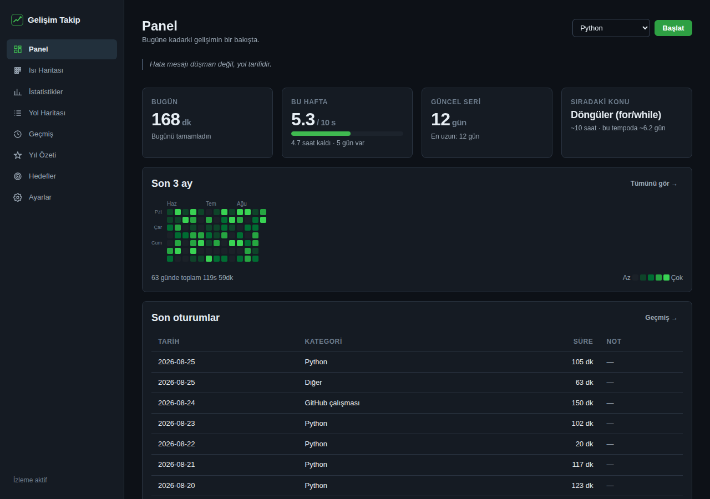
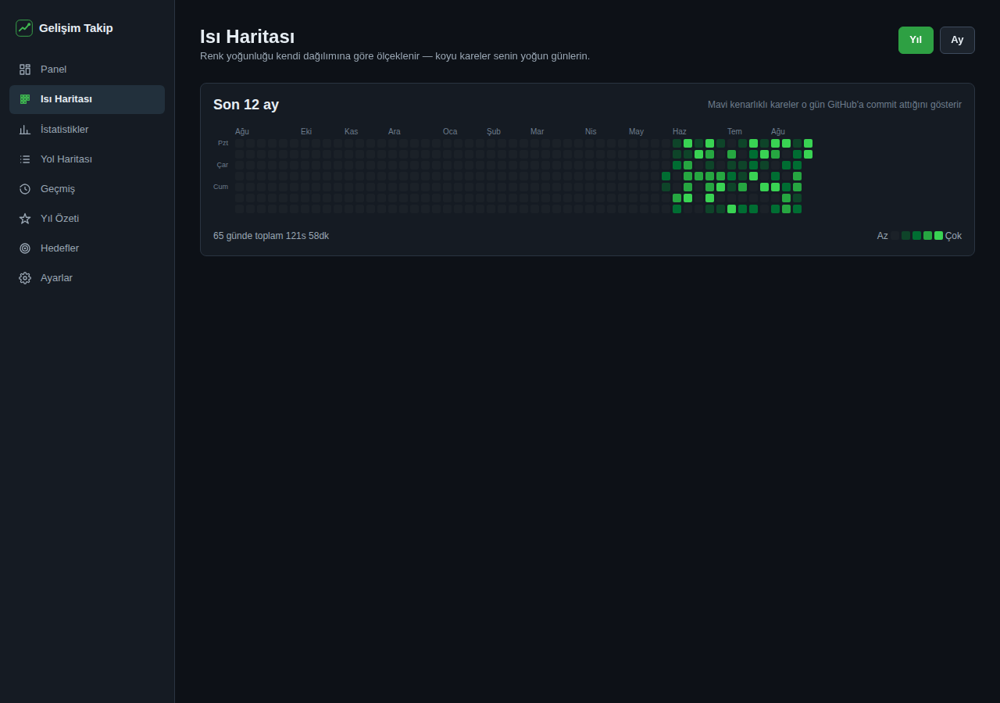
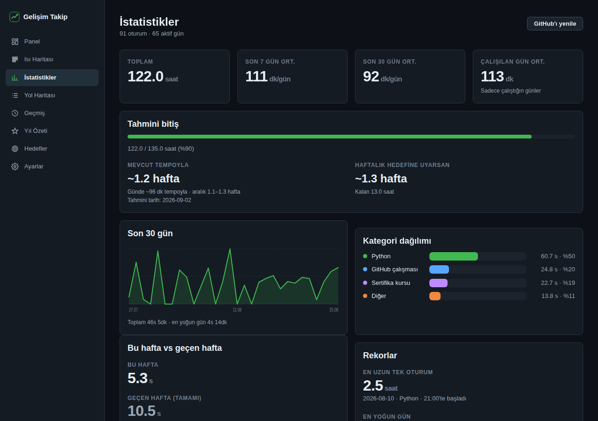
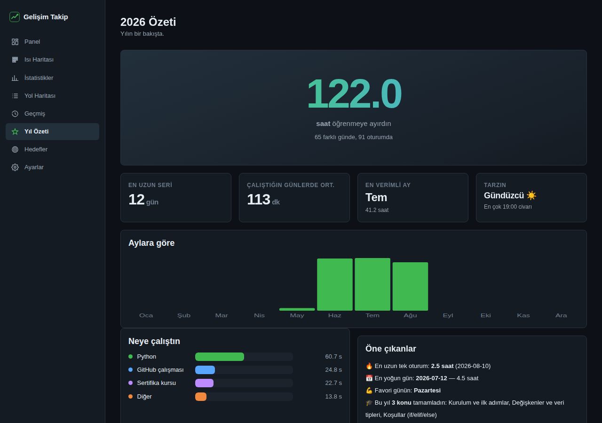

# Gelişim Takip

Python/yazılım öğrenme sürecinde harcanan zamanı **dürüstçe** ölçen bir
Windows masaüstü uygulaması. Kod yazdığın programı ya da kurs siteni
açtığında zamanlayıcı kendiliğinden başlar, klavyeden elini çektiğinde
duraklar, kapattığında durur.

[](https://github.com/yoursel71/developing-tracker/actions/workflows/exe-derle.yml)
[](https://github.com/yoursel71/developing-tracker/releases/tag/masaustu-son-surum)
[](LICENSE)




## Ne yapar

- **Otomatik zaman takibi** — VS Code, PyCharm gibi programlar açıkken ya da
  Udemy gibi kurs siteleri sekmede açıkken süre kendiliğinden işler.
- **Boşta kalma algılama** — 10 dakika (ayarlanabilir) klavye/fare hareketi
  olmazsa sayaç duraklar. Gece açık unutulan editör saat yazmaz; bu olmadan
  tüm istatistikler anlamsızlaşırdı.
- **GitHub tarzı ısı haritası** — 7 satır × 53 hafta, kendi dağılımına göre
  ölçeklenen renkler, GitHub commit'lerin ikinci katman olarak.
- **Seri (streak)** — ardışık çalışma günleri, güncel ve en uzun seri.
- **İstatistikler** — günlük trend, kategori dağılımı, "en verimli günün
  Salı", "en çok 21:00–22:00 arası çalışıyorsun".
- **Akıllı tahmin** — mevcut tempoyla ve haftalık hedefine uyarsan olmak
  üzere iki senaryo, iyimser–kötümser aralık ve tahmini tarih.
- **Öğrenme yol haritası** — her biri tahmini saatli konular; toplam hedef
  bunlardan hesaplanır ve "sıradaki konuyu ~3 günde bitirirsin" der.
- **Oturum notları ve düzenleme** — yanlış kaydı düzelt, sil veya elle ekle.
- **Kendi projelerin** — kategoriler sabit değil; "LocalRun", "BruceButBetter"
  gibi kendi projelerini ekleyip renk verebilirsin. Yeniden adlandırma geçmiş
  kayıtlara da yansır.
- **Hafta karşılaştırması** — bu hafta vs geçen haftanın *aynı gününe kadarki*
  hâli; Salı günü tam bir haftayla kıyaslamak yanıltıcı olurdu.
- **Hedef geçmişi** — hangi haftalarda hedefi tutturdun. Her hafta o günkü
  hedefiyle saklanır, sonradan hedef değişince geçmiş çarpıtılmaz.
- **Mola hatırlatıcısı** — 2 saatten uzun kesintisiz çalışırsan mola önerir.
- **Pomodoro** (isteğe bağlı) — 25/5 ritmi. Süre ölçümünü **değiştirmez**,
  yalnızca ritim tutar; ölçüm her zaman otomatik takibin işidir.
- **Yıl özeti** — "wrapped" tarzı yıllık bakış + indirilebilir rozetler.
  Rozetler bilgisayarında üretilir, hiçbir yere gönderilmez.
- **Yazdırılabilir rapor** — tarayıcıdan PDF olarak kaydedilebilir özet.
- **Klavye kısayolları** — `Boşluk` başlat/durdur, `P/I/S/Y/G/H/A` sayfalar,
  `?` yardım.

## İndir ve çalıştır (Windows)

1. Depo → **Releases** → **Gelişim Takip — Masaüstü (son derleme)**
2. `GelisimTakip.exe` dosyasını indir ve çalıştır.
3. İlk açılışta kurulum sihirbazı hedeflerini, GitHub kullanıcı adını ve
   takip edilecek program/siteleri sorar.

> **SmartScreen uyarısı:** `.exe` imzalı olmadığı için Windows "bilinmeyen
> yayımcı" uyarısı gösterir. "Daha fazla bilgi" → "Yine de çalıştır" ile
> açabilirsin.

Uygulama pencereyi kapatınca **sistem tepsisine iner** ve takibe devam
eder; tamamen çıkmak için tepsi ikonuna sağ tıklayıp "Çıkış" de.
Ayarlar'dan "Windows açılışında otomatik başlat" seçeneğini açarsan
uygulama PC açılışında **pencere göstermeden** yalnızca tepside başlar;
açmak için tepsi ikonuna ya da `GelisimTakip.exe`'ye tekrar tıklaman
yeterli — ikinci tıklama yeni bir kopya açmaz, çalışan pencereyi öne getirir.

## Ekran görüntüleri

| Isı haritası | İstatistikler |
|---|---|
|  |  |

| Yıl özeti |
|---|
|  |

## Tarayıcı eklentisi (kurs siteleri için)

Site takibi için `tarayici-eklentisi/` klasöründeki eklentiyi kurman
gerekir — adımlar [tarayici-eklentisi/README.md](tarayici-eklentisi/README.md)
dosyasında. Eklenti, Ayarlar sayfasındaki **API anahtarını** ister; bu
anahtar olmadan hiçbir site uygulamaya veri gönderemez.

## Verilerin nerede

| Ortam | Konum |
|---|---|
| Windows (.exe) | `%LOCALAPPDATA%\GelisimTakip\` |
| macOS | `~/Library/Application Support/GelisimTakip/` |
| Linux | `~/.local/share/GelisimTakip/` |
| Geliştirme | depo içindeki `data/` |

Bu klasörde `veri.json`, `yedekler/` ve `uygulama.log` bulunur. Veri
**atomik olarak** yazılır (çökme yarım dosya bırakmaz), günde bir yedek
alınır (son 10 tutulur) ve dosya bozulursa otomatik olarak en yeni sağlam
yedeğe dönülür. Ayarlar'dan CSV/JSON dışa aktarabilir, yedekten geri
yükleyebilirsin.

**Gizlilik:** veri yalnızca bu klasörde kalır, hiçbir sunucuya
gönderilmez. GitHub senkronu yalnızca herkese açık Events API'sini okur;
yıl özeti rozetleri bilgisayarında üretilir ve indirmedikçe hiçbir yere
çıkmaz.

`GELISIM_TAKIP_VERI_DIZINI` ortam değişkeniyle konumu değiştirebilirsin.
`.exe`'nin yanına `tasinabilir.txt` koyarsan veri exe'nin yanına yazılır
(USB'den taşınabilir kullanım).

## Kaynaktan çalıştırma

```bash
python -m venv .venv
source .venv/bin/activate          # Windows: .venv\Scripts\activate
pip install -r requirements-dev.txt

python app.py        # tarayıcı sürümü → http://127.0.0.1:57391
python masaustu.py   # native pencere + tepsi ikonu (Windows)
python -m pytest testler/
```

## Nasıl çalışır

**Zaman ölçümü.** Aktif oturum her tarama turunda (10 sn) diske işaretlenir:
`son_gorulme` ve `birikmis_saniye`. Böylece çökmede tüm oturum değil, en
fazla bir tur kaybedilir; açılışta eski `son_gorulme` taşıyan oturumlar
otomatik kapatılır. Bu olmadan Cuma çöken bir uygulama Pazartesi 63 saatlik
sahte bir oturum yazardı.

**Durum makinesi.**

```
YOK ──(program/site algılandı)──> ÇALIŞIYOR
ÇALIŞIYOR ──(boşta eşiği)──> BOŞTA           # süre birikmez
BOŞTA ──(klavye/fare)──> ÇALIŞIYOR           # kesintisiz devam
ÇALIŞIYOR ──(algılanmıyor)──> KAYIP          # 60 sn grace
KAYIP ──(tekrar algılandı)──> ÇALIŞIYOR
KAYIP ──(grace doldu)──> YOK                 # oturum kaydedilir
```

Kısa molalar geçmişi onlarca parçaya bölmez; gece yarısını geçen oturumlar
gün sınırında bölünür (yoksa Pazar gecesi çalışması önceki haftaya yazılırdı).
Bir program yalnızca **tek bir** kategoriye bağlanabilir — aksi hâlde aynı
süre iki kez sayılırdı.

## Bilinen sınırlamalar

- **Boşta algılama, tepsi ikonu ve Windows açılışı yalnızca Windows'ta**
  çalışır. Linux/macOS'ta uygulama çalışır ama kullanıcı hiç boşta sayılmaz.
- Site takibi tarayıcı eklentisi olmadan çalışmaz.
- GitHub'ın herkese açık Events API'si yalnızca **son ~90 günü** ve yalnızca
  herkese açık push etkinliklerini döndürür; saatte 60 istek sınırı vardır
  (veri 1 saat önbelleklenir). `GITHUB_TOKEN` ortam değişkeniyle sınırı
  artırabilirsin.
- Uygulama sabit `57391` portunu kullanır (`GELISIM_TAKIP_PORT` ile
  değiştirilebilir). İkinci bir örnek açılmaz; veri bozulmasını önlemek için
  tek örnek kilidi vardır — `.exe`'ye tekrar tıklamak yeni bir kopya açmaz,
  çalışan pencereyi öne getirir.

## Proje yapısı

```
app.py                  Flask rotaları ve JSON API
masaustu.py             pywebview + tepsi giriş noktası (.exe)
config.py               sabitler ve yol yardımcıları
depo/                   JSON deposu, şema göçü, varsayılanlar
servisler/              zaman takibi, izleme motoru, istatistik, doğrulama
platform_katmani/       Windows'a özgü kod (boşta, tepsi, autostart, yollar)
templates/ static/      arayüz
varliklar/              ikon kaynağı ve README ekran görüntüleri
araclar/                ikon üretimi ve ekran görüntüsü alma script'leri
tarayici-eklentisi/     Chrome/Edge eklentisi (Manifest V3)
testler/                pytest paketi
```

## Katkı

Hata bildirimi ve özellik isteği için [Issues](../../issues) sayfasını,
kod katkısı için [CONTRIBUTING.md](CONTRIBUTING.md) dosyasını kullan.
Sürüm geçmişi için [CHANGELOG.md](CHANGELOG.md).

## Lisans

[MIT](LICENSE)
